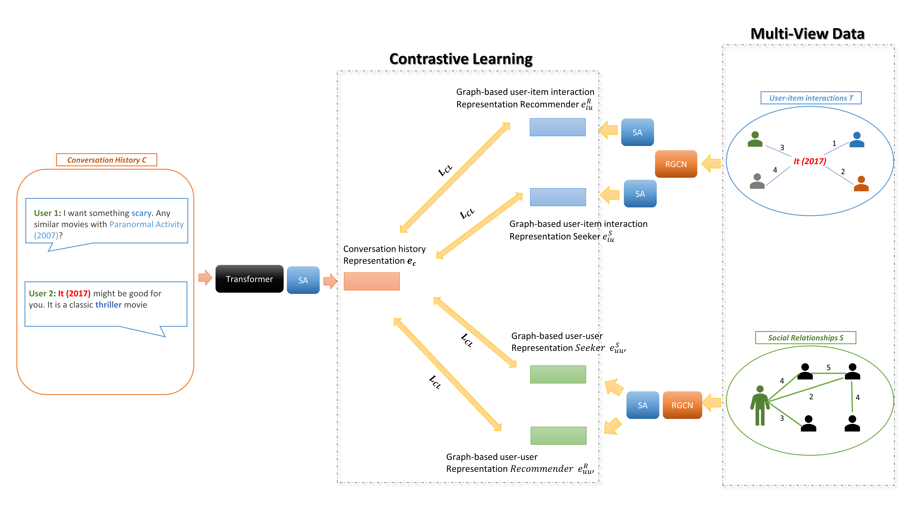

# Improving Social Information Sensitive Semantic Fusion Using Contrastive Learning in Conversational Recommender System
The source code for our SISSF 2024 Paper [**"Improving Social Information Sensitive Semantic Fusion Using Contrastive Learning in Conversational Recommender System"**](https://xxxx)
Mohammed Abdulaziz, Zhang Mingwei, and Wang Ruizhe

## Requirements
* loguru == 0.7.2
* numpy == 2.0.1
* sentencepiece == 0.2.0
* fasttext == 0.9.3
* pkuseg == 0.0.25
* pyyaml == 6.0.2
* tqdm == 4.66.5
* scikit-learn == 1.5.1
* fuzzywuzzy == 0.18.0
* requests
* nltk
* ipdb
* torch_geometric
* pandas == 2.2.2
* torch == 2.4.0
* tensorboard == 2.17.0

## Overview
This paper presents an innovative framework for inducting social information from existing conversational dataset by inferring ratings and constructing user-item interaction and user-user relationship graphs. It also introduces a social information-sensitive semantic fusion approach, leveraging contrastive learning to bridge the semantic gap between social information and conversation history. Such an approach promises to deepen the understanding of user preferences and yield more personalized recommendations. We conduct experiments on two public datasets, and the results consistently confirm the effectiveness of our approach in both recommendation and conversational tasks.

Hope it can help you!



## Datasets and Other Resource
### Datasets
We use two datasets in our paper [ReDial dataset](https://papers.nips.cc/paper/2018/file/800de15c79c8d840f4e78d3af937d4d4-Paper.pdf) and [INSPIRED dataset](https://aclanthology.org/2020.emnlp-main.654.pdf), all of which have been uploaded to [Google Drive](https://drive.google.com/file/d/11yUFFz8iI5hYZxFjlOnLQpqjt0T8J18x/view?usp=sharing) and [Baidu Netdisk](https://pan.baidu.com/s/1zrV5SbAt5X-C1SLkja3sqQ) (password: zmfm).

The downloaded `dataset` folder should be placed in the `data` folder.

in case you want to generate the datasets used for the project you can check `ExtractProject` folder and check `README.md` file for more information. 

### Saved Models
We have trained our model on the datasets mentioned above, all of which have been uploaded to [Google Drive](https://drive.google.com/file/d/1fY-4i5MxnZxb31bDlRA8dcGp-RYkDC8n/view?usp=sharing) and [Baidu Netdisk](https://pan.baidu.com/s/11_LATzJsnvGo6oFgSQ5beg) (password: fhro).

The downloaded `weights` folder contains weights files for different mode, and then move its content to the `output` folder.

## Steps to run SISSF project

* Downlaod the `dataset` and placed into 'data/dataset' folder
* Navigate to `data/dataset` folder and run the following command to download and unzip fasttext weights
```
cd data/dataset
wget https://dl.fbaipublicfiles.com/fasttext/vectors-crawl/cc.en.300.bin.gz
gunzip cc.en.300.bin.gz

```
* install the dependencies reuqired by the SISSF project in `requirements.txt`
```
pip install -r requirements.txt

```
* Navigate to the root directory of your project (where pyproject.toml file is located) and run the build command
```
python -m build

```
* To Test the current saved model you can run the command for Semantic Fusion for ReDial and INSPIRED

```

python run_SISSF.py --batch-size 300  --test-batch-size 300 --valid-batch-size 300 --lr 0.00001 --weight-decay 0.0 --sem-dropout 0.1 --tem 0.09 --mode semantic --resume-learning output/semantic/ReDial_semantic_sf.state  --dataset-type ReDial --test-mode True

python run_SISSF.py --batch-size 300  --test-batch-size 300 --valid-batch-size 300 --lr 0.00001 --weight-decay 0.0 --sem-dropout 0.1 --tem 0.09 --mode semantic --resume-learning output/semantic/INSPIRED_semantic_sf.state  --dataset-type INSPIRED --test-mode True

```

for recommendation task for ReDial and INSPIRED 

```

python run_SISSF.py --batch-size 300  --test-batch-size 300 --valid-batch-size 300 --lr 0.00001 --weight-decay 0.0 --sem-dropout 0.1 --tem 0.13 --mode rec --rec-layers 4 --rec-heads 4 --resume-learning output/rec/ReDial_semantic_rec.state  --dataset-type ReDial --test-mode True

python run_SISSF.py --batch-size 300  --test-batch-size 300 --valid-batch-size 300 --lr 0.00001 --weight-decay 0.0 --sem-dropout 0.1 --tem 0.13 --mode rec --rec-layers 4 --rec-heads 4 --resume-learning output/rec/INSPIRED_semantic_rec.state  --dataset-type INSPIRED --test-mode True

```

for conversational task for ReDial and INSPIRED 


```

python run_SISSF.py --batch-size 300  --test-batch-size 300 --valid-batch-size 300 --lr 0.00001 --weight-decay 0 --conv-dropout 0.1 --tem 0.13 --mode conv --conv-layers 4 --conv-heads 4  --conv-ffn-size 300 --resume-learning output/conv/ReDial_semantic_conv.state --dataset-type ReDial --test-mode True


python run_SISSF.py --batch-size 300  --test-batch-size 300 --valid-batch-size 300 --lr 0.0001 --weight-decay 0 --conv-dropout 0.1 --tem 0.13 --mode conv --conv-layers 4 --conv-heads 4  --conv-ffn-size 300 --resume-learning output/conv/INSPIRED_semantic_conv.state --dataset-type INSPIRED --test-mode True

```

* To train the model. for semantic fusion for ReDial and INSPIRED 

```
python run_SISSF.py --batch-size 300  --test-batch-size 300 --valid-batch-size 300 --lr 0.00001 --weight-decay 0.0 --sem-dropout 0.1 --tem 0.09 --mode semantic --dataset-type ReDial

python run_SISSF.py --batch-size 300  --test-batch-size 300 --valid-batch-size 300 --lr 0.00001 --weight-decay 0.0 --sem-dropout 0.1 --tem 0.09 --mode semantic --dataset-type INSPIRED

```

for recommendation task for ReDial and INSPIRED

```
python run_SISSF.py --batch-size 300  --test-batch-size 300 --valid-batch-size 300 --lr 0.00001 --weight-decay 0.0 --sem-dropout 0.1 --tem 0.13 --mode rec --rec-layers 4 --rec-heads 4  --semantic-fusion-weights output/semantic/model_best.state  --dataset-type ReDial

python run_SISSF.py --batch-size 300  --test-batch-size 300 --valid-batch-size 300 --lr 0.00001 --weight-decay 0.0 --sem-dropout 0.1 --tem 0.13 --mode rec --rec-layers 4 --rec-heads 4  --semantic-fusion-weights output/semantic/model_best.state  --dataset-type INSPIRED

```

for conversational task for ReDial and INSPIRED

```
python run_SISSF.py --batch-size 300  --test-batch-size 300 --valid-batch-size 300 --lr 0.00001 --weight-decay 0 --conv-dropout 0.1 --tem 0.13 --mode conv --conv-layers 4 --conv-heads 4  --conv-ffn-size 300 --semantic-fusion-weights output/rec/model_best.state --dataset-type ReDial

python run_SISSF.py --batch-size 300  --test-batch-size 300 --valid-batch-size 300 --lr 0.0001 --weight-decay 0 --conv-dropout 0.1 --tem 0.13 --mode conv --conv-layers 4 --conv-heads 4  --conv-ffn-size 300 --semantic-fusion-weights output/rec/model_best.state --dataset-type INSPIRED

```


## Contact
If you have any questions for our paper or codes, please send an email to ggffhh3344@gmail.com.

## Acknowledgement 
Our code is developed based on [C2CRS](https://github.com/Zyh716/WSDM2022-C2CRS)

And thanks the code from [dlwpt-code](https://github.com/deep-learning-with-pytorch/dlwpt-code) and from  [KGSF](https://github.com/Lancelot39/KGSF) 


Any scientific publications that use our codes and datasets should cite the following paper as the reference:
```
@inproceedings{10.1145/3488560.3498514,
title = {Improving Social Information Sensitive Semantic Fusion Using Contrastive Learning in Conversational Recommender System},
author = {Mohammed Abdulaziz, Zhang Mingwei, Wang Ruizhe},
booktitle = {WSDM},
year = {2024},
}
```