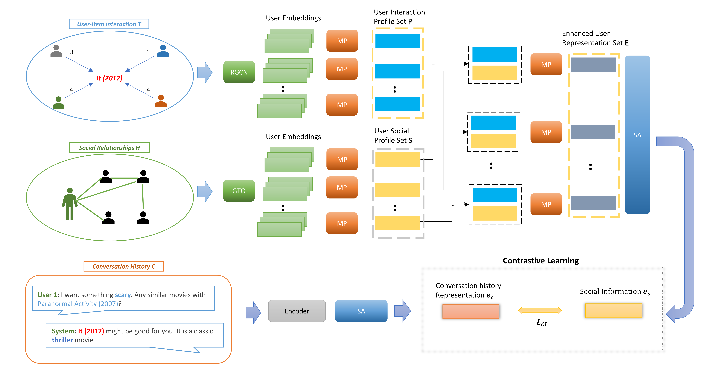

# Social Information Sensitive Conversational Recommendation Using Multi-View Contrastive Learning
The source code for our WSDM 2022 Paper [**"Social Information Sensitive Conversational Recommendation Using Multi-View Contrastive Learning"**](https://xxxx)


## Requirements
* loguru == 0.7.2
* numpy == 2.0.1
* sentencepiece == 0.2.0
* fasttext == 0.9.3
* pkuseg == 0.0.25
* pyyaml == 6.0.2
* tqdm == 4.66.5
* scikit-learn == 1.5.1
* fuzzywuzzy == 0.18.0
* requests
* nltk
* ipdb
* torch_geometric
* pandas == 2.2.2
* torch == 2.4.0
* tensorboard == 2.17.0

## Overview
This paper presents an innovative framework for constructing a social graph from existing conversational datasets, considering user-item interactions and shared interests among users. It also introduces a social information-sensitive semantic fusion approach, leveraging multi-view contrastive learning to bridge the semantic gap between the social relationships graph and conversation history. Such an approach promises to deepen the understanding of user preferences and yield more personalized recommendations.



## Datasets and Other Resource
### Datasets
We use two datasets in our paper, all of which have been uploaded to [Google Drive](https://drive.google.com/file/d/1_lyTW0ahKKaFDjI_sbSkCHkDGWL8-Cae/view?usp=sharing) and [Baidu Netdisk](https://pan.baidu.com/s/1FvdLomclVf1p6kmWIoOI9A) (password: 5mrw).

The downloaded `dataset` folder should be placed in the `data` folder.

in case you want to generate the dataset used for the project you can cehck `_extractProject` folder and check `README.md` file for more information. 

### Saved Models
We have trained our model on the dataset mentioned above, all of which have been uploaded to [Google Drive](https://drive.google.com/file/d/1-yYEllsWd-tW4ngCwu8sCNR3soR4dHIF/view?usp=sharing) and [Baidu Netdisk](https://pan.baidu.com/s/17Rj4XthmJGzxDyT1RbXHWQ) (password: 28hi).

The downloaded `weights` folder contains weights files for different mode, `semantic_sf.state` have to be placed under `output/semantic`,
`semantic_rec.state` have to be placed under `output/rec`, lastly the file `semantic_conv.state` have to be palced under `output/conv`

## Steps to run SISSF project

* Downlaod the `dataset` and placed into 'data/dataset' folder
* Navigate to `data/dataset` folder and run the following command to download and unzip fasttext weights
```
cd data/dataset
wget https://dl.fbaipublicfiles.com/fasttext/vectors-crawl/cc.en.300.bin.gz
gunzip cc.en.300.bin.gz

```
* install the dependencies reuqired by the SISSF project in `requirements.txt`
```
pip install -r requirements.txt

```
* Navigate to the root directory of your project (where your pyproject.toml file is located) and run the build command
```
python -m build

```
* To Test the current saved model you can run the command for Semantic Fusion

```

python run_SISSF.py --batch-size 300  --test-batch-size 300 --valid-batch-size 300 --lr 0.0001 --weight-decay 0.0 --sem-dropout 0.1 --tem 0.07 --mode semantic --resume-learning output/semantic/semantic_sf.state --test-mode True

```

for recommendation task

```

python run_SISSF.py --batch-size 300  --test-batch-size 300 --valid-batch-size 300 --lr 0.0001 --weight-decay 0.0 --sem-dropout 0.1 --tem 0.07 --mode rec --rec-layers 4 --rec-heads 4 --resume-learning output/rec/semantic_rec.state --test-mode True

```

for conversational task 

```

python run_SISSF.py --batch-size 300  --test-batch-size 300 --valid-batch-size 300 --lr 0.0001 --weight-decay 0 --conv-dropout 0.1 --tem 0.07 --mode conv --conv-layers 4 --conv-heads 4  --conv-ffn-size 300--resume-learning output/conv/semantic_conv.state --test-mode True

```

* To train the model. for semantic fusion 

```
python run_SISSF.py --batch-size 300  --test-batch-size 300 --valid-batch-size 300 --lr 0.0001 --weight-decay 0.0 --sem-dropout 0.1 --tem 0.07 --mode semantic

```

for recommendation task

```
run_SISSF.py --batch-size 300  --test-batch-size 300 --valid-batch-size 300 --lr 0.0001 --weight-decay 0.0 --sem-dropout 0.1 --tem 0.07 --mode rec --rec-layers 4 --rec-heads 4  --semantic-fusion-weights output/semantic/model_best.state

```

for conversational task

```
python run_SISSF.py --batch-size 300  --test-batch-size 300 --valid-batch-size 300 --lr 0.0001 --weight-decay 0 --conv-dropout 0.1 --tem 0.07 --mode conv --conv-layers 4 --conv-heads 4  --conv-ffn-size 300 --semantic-fusion-weights output/rec/model_best.state

```


## Contact
If you have any questions for our paper or codes, please send an email to ggffhh3344@gmail.com.

## Acknowledgement 
Our code is developed based on [C2CRS](https://github.com/Zyh716/WSDM2022-C2CRS)

And thanks the code from [dlwpt-code](https://github.com/deep-learning-with-pytorch/dlwpt-code) and from  [KGSF](https://github.com/Lancelot39/KGSF) 


Any scientific publications that use our codes and datasets should cite the following paper as the reference:
```
@inproceedings{10.1145/3488560.3498514,
title = {Social Information Sensitive Conversational Recommendation Using Multi-View Contrastive Learning},
author = {Mohammed Abdulaziz, Zhang Mingwei},
booktitle = {WSDM},
year = {2024},
}
```